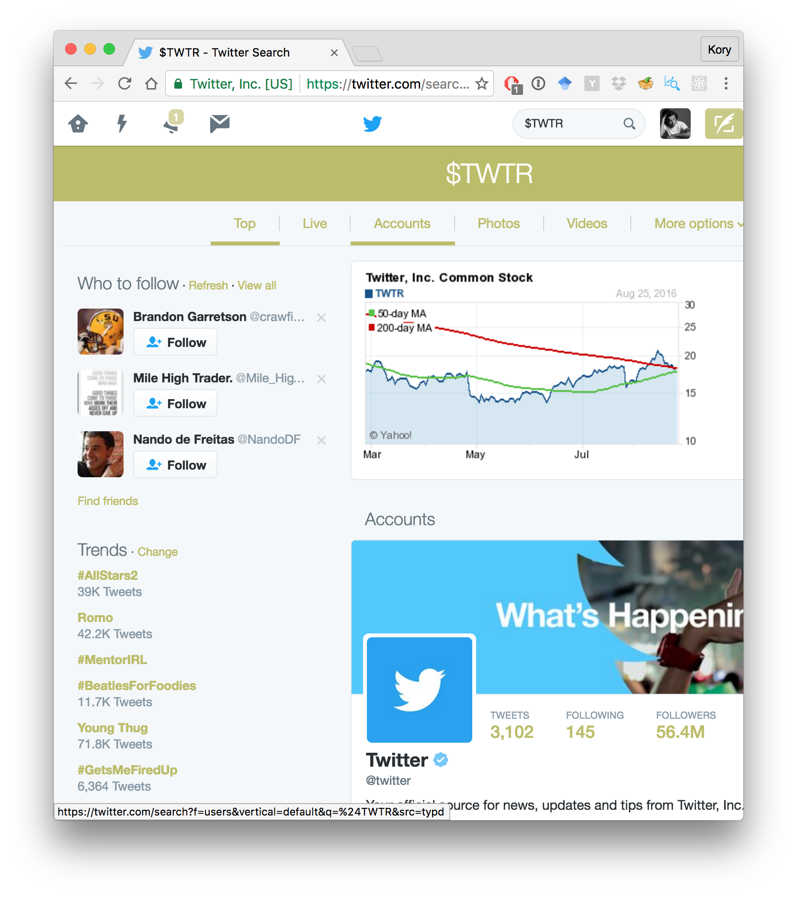
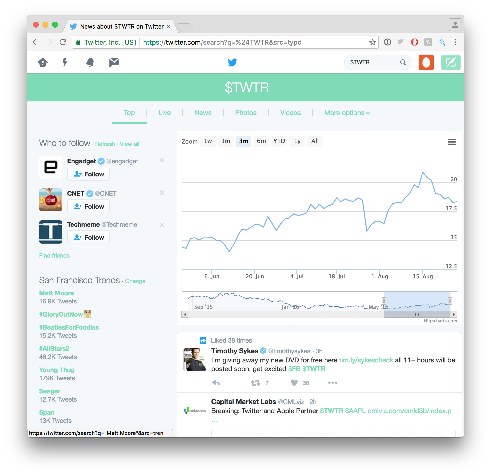

# StockView
Twitter can tell us what's happening, but it is not great for finding business information.

With this extension, you will be able to see live stock information right in your Twitter feed providing context for the current discussion.

Now, when you search Twitter for cashtags like '$TWTR', the stock chart will be displayed so you can really know what is happening.

# Install

\#StockView is packaged as a chrome extension. You can download it here, and then follow these steps to install an extension from source.

Amusingly "For regular Windows users who are not skilled with computers, it is practically not possible to install and use extensions from outside the Chrome Web Store." -- http://stackoverflow.com/questions/24577024/install-chrome-extension-not-in-the-store

If you are not using a windows machine: 

1. Extensions can be loaded in unpacked mode by following the following steps:
2. Visit chrome://extensions (via omnibox or menu -> Tools -> Extensions).
3. Enable Developer mode by ticking the checkbox in the upper-right corner.
4. Click on the "Load unpacked extension..." button.
5. Select the directory containing your unpacked extension.

Development Screenshots

Before
==========
Company is suggested, perhaps an account is shown and several recent tweets populate the timeline below.

v1
==========
Rough chart inserted nicely.

v3
==========
Beautiful chart comes in.

v4
==========
Multiple stock tickers.

# Technology 

Highstocks for plotting http://www.highcharts.com/
Data comes from Yahoo historical stock API
